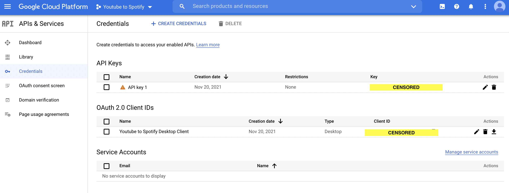

# Automatically_Create_Spotify_Playlist_From_Youtube_Liked_Videos
This script identifies music videos in your Youtube's LIKED section and automatically creates a corresponding playlist in your Spotify account.

* Obtain Spotify from your Spotify account and Spotify outh token from [here](https://developer.spotify.com/console/post-playlists/?user_id=&body=%7B%22name%22%3A%22New%20Playlist%22%2C%22description%22%3A%22New%20playlist%20description%22%2C%22public%22%3Afalse%7D).

* Follow this [link](https://developers.google.com/youtube/v3/getting-started/) to get client_id, client_secret and YOUR_API_KEY. 

* Link to the spotify playlist I created from my Youtube likes: https://open.spotify.com/playlist/4lUP5ovngkEBPhzlsLLHGj?si=c216fc1732164846

<video src='Spotify.mov'/>

